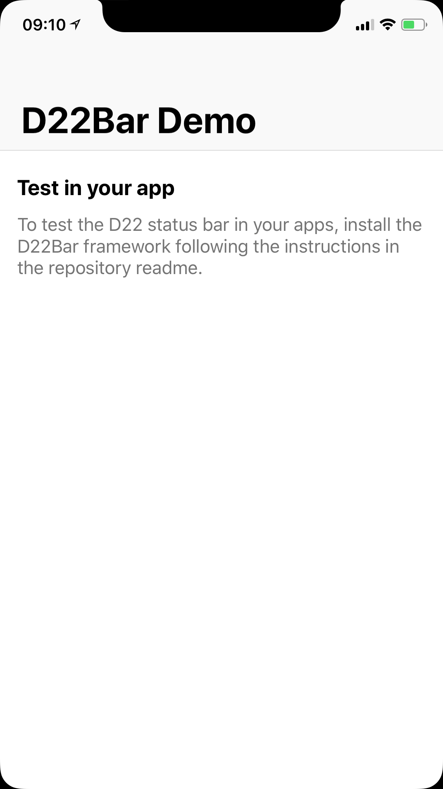
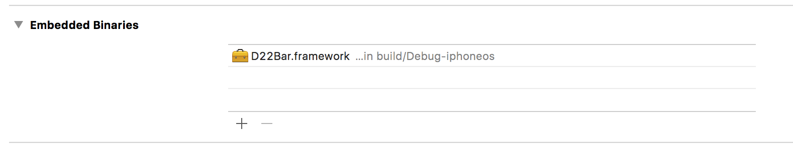

# D22Bar
Test your app with the new iPhone status bar.



# Disclaimers

- This will only work with the iOS 11 GM or later, it will not work with previous betas of iOS. If you don't have the GM installed, there's no way to install it currently since Apple stopped signing the leaked builds.
- The metrics (corner radius and notch shape) might not be accurate, this is just an emulation
- Only tested on an iPhone 7 Plus, I don't know how it looks on other devices
- This will not work on the Simulator

# How to use

Just link your app with `D22Bar.framework`. That's all.

You can embed the framework directly or use [Carthage](https://github.com/Carthage/Carthage) to install it.

**Embed directly:**

Add `D22Bar.xcodeproj` and add `D22Bar.framework` to the Embedded Binaries section in your target settings.



**Carthage:**

```
github "insidegui/D22Bar"
```